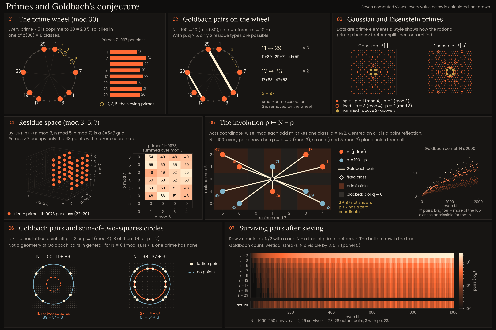

# Goldbach Visualizations



> Computational visualizations exploring primes, residue structure, sieving,
> and Goldbach's conjecture, with independent verification of the plotted data.

`generate_visualizations.py` draws seven panels from settings at the top of the
file. Every plotted point, count and number-bearing label is computed at run
time. The worked example is N = 100.

## The seven panels

1. **The prime wheel (mod 30).** Every prime greater than 5 is coprime to
   30 = 2·3·5, so it lies in one of the φ(30) = 8 coprime residue classes. A bar
   chart counts the primes from 7 to 997 in each class.

2. **Goldbach pairs on the wheel.** The actual Goldbach pairs of N = 100 are
   drawn as chords between residue classes mod 30. Since 100 ≡ 10 (mod 30),
   p ≡ r forces q ≡ 10 − r, so with p, q > 5 only two residue types are
   possible: {11, 29} and {17, 23}. The pair 3 + 97 is shown separately as a
   small-prime exception.

3. **Gaussian and Eisenstein primes.** Prime elements of ℤ[i] and ℤ[ω] in a
   bounded window. Each is marked by how the rational prime below it factors:
   split (p ≡ 1 mod 4, p ≡ 1 mod 3), inert (p ≡ 3 mod 4, p ≡ 2 mod 3) or
   ramified (above 2, above 3).

4. **Residue space (mod 3, 5, 7).** By CRT, n ↦ (n mod 3, n mod 5, n mod 7)
   is a 3×5×7 grid. Primes greater than 7 occupy only the 48 points with no zero
   coordinate. A 3D scatter sizes each of these classes by its count of primes
   from 11 to 9973. A heatmap shows the same counts by (mod 5, mod 7), summed
   over mod 3.

5. **The involution p ↦ N − p.** Mod each odd m, this map fixes one residue
   class, c ≡ N/2 (mod m). Plotted in (mod 7, mod 5) coordinates centred on c,
   it is a point reflection: each Goldbach pair of 100 with p > 7 is a segment
   whose midpoint is the fixed class. Cells where p or N − p would be divisible
   by 5 or 7 are marked as blocked. An inset shows the Goldbach comet (number of
   pairs for even N ≤ 2000), coloured by how many of the 105 residue classes
   are admissible for each N.

6. **Goldbach pairs and sum-of-two-squares circles.** For each prime in a pair,
   the circle |z|² = p is drawn on the integer lattice. It has lattice points
   iff p = 2 or p ≡ 1 (mod 4). This is not a geometry of Goldbach pairs in
   general: for N ≡ 0 (mod 4), N > 4, one prime of each pair has no lattice
   points. The panel shows one pair of each kind (100 = 11 + 89 and
   98 = 37 + 61).

7. **Surviving pairs after sieving.** For each even N from 4 to 1000, the
   candidate pairs are a + (N − a) with a ≤ N/2. Each heatmap row sieves by one
   more prime from `SIEVE_ZS` (2 to 23) and counts the pairs where neither a nor
   N − a is divisible by any prime sieved so far. These survivors are not
   necessarily primes. The bottom row is the actual Goldbach count. Divisibility
   of N by small primes produces visible vertical structure in the heatmap.

## Verification

The script runs its checks before saving each layout and stops if any fails.
It also writes `verification_report.txt` with the results.

Per layout, the checks are:

- consistency checks made while drawing, such as labels agreeing with the data;
- a colour audit and a text-contrast audit of the drawn figure;
- `verify()`, which recomputes the plotted data without the program's numpy
  sieve or drawing helpers. It uses trial-division primality, brute-force
  Gaussian and Eisenstein irreducibility, and brute-force sieving, then compares
  the results with values read back from the plotted artists and figure text.

These checks confirm that the computations and plotted values in this program
are consistent. They are not a proof of Goldbach's conjecture.

## Running

```
pip install -r requirements.txt
python generate_visualizations.py
```

Run from the repository root, since output paths are relative. The intended
typography uses Poppins and Lora. If they are not installed, matplotlib falls
back to DejaVu Sans and DejaVu Serif, and the images will look different from
the committed ones.

Requires Python 3.8 or later. Tested with Python 3.12.10, matplotlib 3.9.3 and numpy 2.1.3.

## Outputs

- `images/landscape.png`: 3600 × 2400
- `images/linkedin-4x5.png`: 2160 × 2700

Running the script also writes `verification_report.txt` and smaller preview
images (`images/*-preview.png`). These are generated outputs and are ignored
by Git.

## License

MIT License. See [LICENSE](LICENSE).
