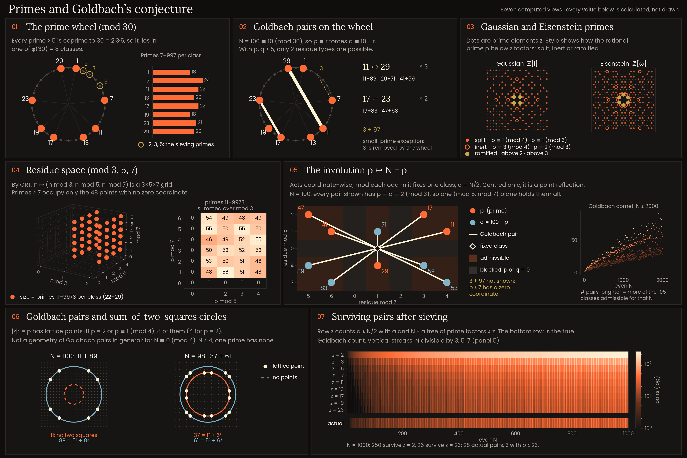
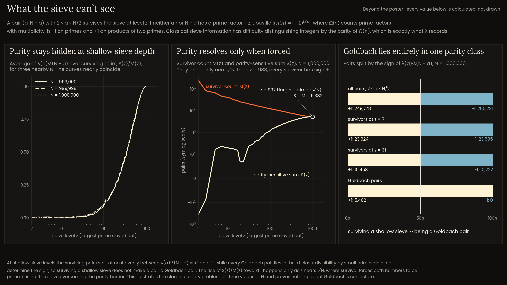
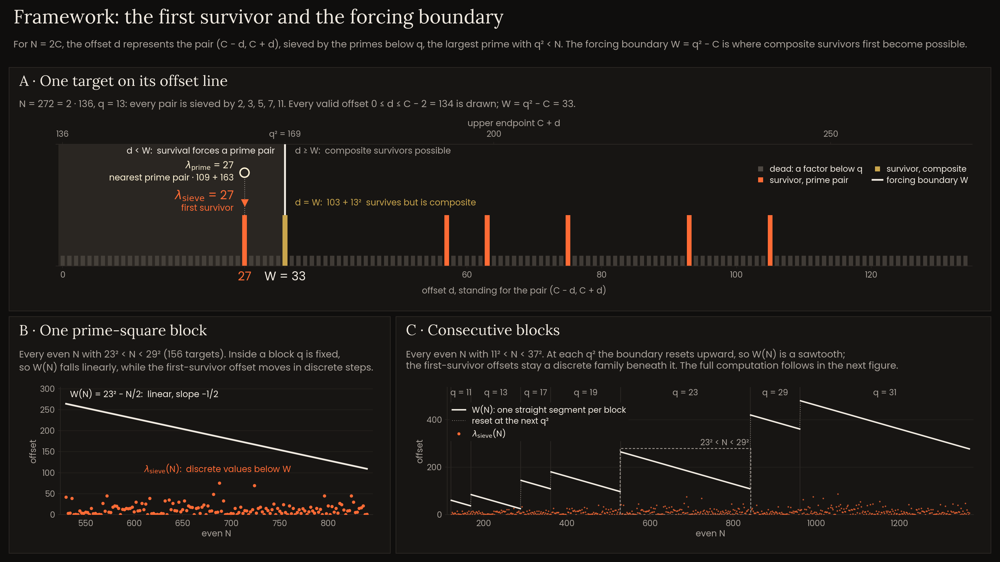
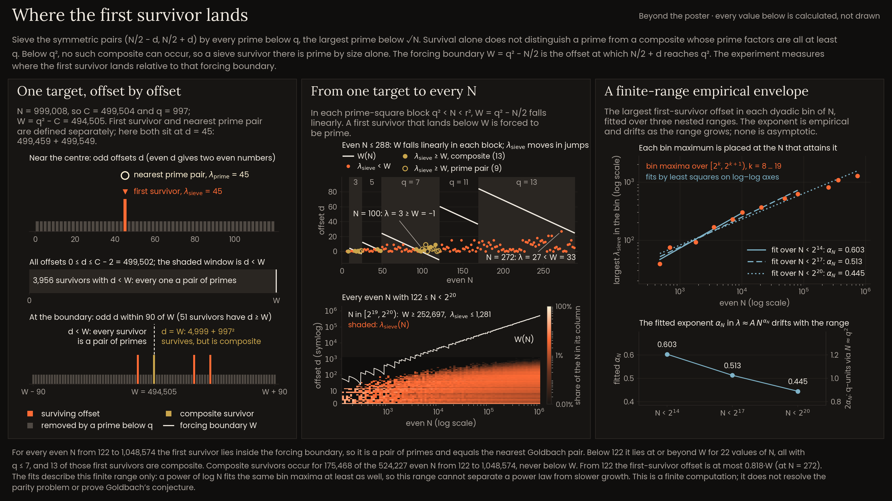
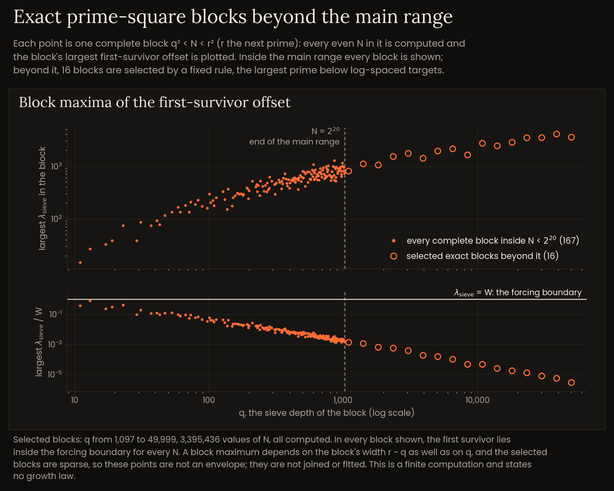

# Goldbach Visualizations



> Computational visualizations exploring primes, residue structure, sieving,
> and Goldbach's conjecture, with independent cross-checks of the plotted data.

`generate_visualizations.py` draws seven panels from settings at the top of the
file. Every plotted point, count and number-bearing label is computed at run
time. The worked example is N = 100.

## The seven panels

1. **The prime wheel (mod 30).** Every prime greater than 5 is coprime to
   30 = 2·3·5, so it lies in one of the φ(30) = 8 coprime residue classes. A bar
   chart counts the primes from 7 to 997 in each class.

2. **Goldbach pairs on the wheel.** The actual Goldbach pairs of N = 100 are
   drawn as chords between residue classes mod 30. Since 100 ≡ 10 (mod 30),
   p ≡ r forces q ≡ 10 − r, so with p, q > 5 only two residue types are
   possible: {11, 29} and {17, 23}. The pair 3 + 97 is shown separately as a
   small-prime exception.

3. **Gaussian and Eisenstein primes.** Prime elements of ℤ[i] and ℤ[ω] in a
   bounded window. Each is marked by how the rational prime below it factors:
   split (p ≡ 1 mod 4, p ≡ 1 mod 3), inert (p ≡ 3 mod 4, p ≡ 2 mod 3) or
   ramified (above 2, above 3).

4. **Residue space (mod 3, 5, 7).** By CRT, n ↦ (n mod 3, n mod 5, n mod 7)
   is a 3×5×7 grid. Primes greater than 7 occupy only the 48 points with no zero
   coordinate. A 3D scatter sizes each of these classes by its count of primes
   from 11 to 9973. A heatmap shows the same counts by (mod 5, mod 7), summed
   over mod 3.

5. **The involution p ↦ N − p.** Mod each odd m, this map fixes one residue
   class, c ≡ N/2 (mod m). Plotted in (mod 7, mod 5) coordinates centred on c,
   it is a point reflection: each Goldbach pair of 100 with p > 7 is a segment
   whose midpoint is the fixed class. Cells where p or N − p would be divisible
   by 5 or 7 are marked as blocked. An inset shows the Goldbach comet (number of
   pairs for even N ≤ 2000), coloured by how many of the 105 residue classes
   are admissible for each N.

6. **Goldbach pairs and sum-of-two-squares circles.** For each prime in a pair,
   the circle |z|² = p is drawn on the integer lattice. It has lattice points
   iff p = 2 or p ≡ 1 (mod 4). This is not a geometry of Goldbach pairs in
   general: for N ≡ 0 (mod 4), N > 4, one prime of each pair has no lattice
   points. The panel shows one pair of each kind (100 = 11 + 89 and
   98 = 37 + 61).

7. **Surviving pairs after sieving.** For each even N from 4 to 1000, the
   candidate pairs are a + (N − a) with a ≤ N/2. Each heatmap row sieves by one
   more prime from `SIEVE_PRIMES` (2 to 23) and counts the pairs where neither
   a nor N − a is divisible by any prime sieved so far. These survivors are not
   necessarily primes. The bottom row is the actual Goldbach count. Divisibility
   of N by small primes produces visible vertical structure in the heatmap.

## Beyond the poster: what the sieve can't see



The seven panels show local information: residue classes, the classes the
involution p ↦ N − p leaves admissible, and the pairs that survive sieving by
small primes. This optional extra, generated separately from the poster, asks
what that kind of information does not retain.

For even N and a sieve level z, a pair (a, N − a) with 2 ≤ a ≤ N/2 survives
if neither a nor N − a has a prime factor ≤ z. Unlike panel 7, a starts at 2:
1 has no prime factors, so (1, N − 1) would survive every level without being
a pair of primes. The figure tracks two quantities as z runs through the
primes up to √N:

- M_z(N), the number of surviving pairs. This is what the sieve counts.
- S_z(N), the sum of λ(a)·λ(N − a) over those pairs.

Here λ is Liouville's function, λ(n) = (−1)^Ω(n), where Ω(n) counts prime
factors with multiplicity. It is −1 on primes and +1 on products of two
primes, so it records the parity of the number of prime factors. Sieve
information comes from divisibility by small primes. This is closely related
to the classical parity problem in sieve theory, which concerns the difficulty
of distinguishing integers according to the parity of their number of prime
factors using sieve information alone. The figure does not prove that result;
it only illustrates the phenomenon numerically.

The figure has three panels:

- **Parity stays hidden at shallow sieve depth.** The average S_z/M_z for
  N = 999,000, 999,998 and 1,000,000. At small z it is close to 0: the
  survivors split almost evenly by the sign of λ(a)·λ(N − a).
- **Parity resolves only when forced.** M_z and S_z for N = 1,000,000. They
  meet only near √N: from z = 983 every survivor has sign +1, and at z = 997,
  the largest prime ≤ √N, every surviving pair is a pair of primes, so
  S_z = M_z = 5,382. These are the Goldbach pairs of 1,000,000 with both primes
  greater than √N; of its 5,402 pairs, 20 have p ≤ √N.
- **Same to the sieve, opposite for Goldbach.** Groups of pairs for
  N = 1,000,000 split by the sign of λ(a)·λ(N − a): all pairs, the survivors at
  z = 7 and z = 31, and the Goldbach pairs. The first three are close to 50/50;
  all 5,402 Goldbach pairs have sign +1 and none has sign −1. Surviving a shallow
  sieve therefore does not make a pair a Goldbach pair: divisibility by small
  primes does not determine the sign.

The rise toward 1 is not the sieve overcoming the parity barrier. It happens
because, as z approaches √N, the surviving condition itself eventually forces
primality: at the last level each number in a surviving pair is prime. At
shallower levels, however, the local divisibility conditions give little
control over the parity of Ω(n), which is the phenomenon this figure is meant
to illustrate. S_z > 0 at the last level would establish a representation of N
with both primes greater than √N, which is stronger than Goldbach's conjecture
for that N.

The figure illustrates a known obstruction for three values of N. It is not a
proof of Goldbach's conjecture and not a method for getting around the parity
barrier.

## Beyond the poster: where the first survivor lands

The parity figure ends at the largest prime ≤ √N, where every survivor is a pair
of primes. This second optional extra asks where that forcing comes from, and
where the first survivor lands relative to it. Once composite survivors become
possible, sieve survival alone no longer identifies a prime pair. The forcing
boundary marks the threshold where that ambiguity begins. The framework below
shows how the first-survivor offset is defined relative to that boundary.



Panel A draws one small target, N = 272 (q = 13), on its offset line, with
every valid offset d standing for the pair (136 − d, 136 + d). The first
survivor and the nearest Goldbach pair both sit at d = 27, inside the forcing
boundary W = 33. At d = W the upper endpoint is 13² = 169, and the pair
103 + 169 survives the sieve while being composite. Panel B shows one
prime-square block, 23² < N < 29², where W(N) is a straight line and the
first-survivor offsets are discrete points beneath it. Panel C places the blocks
from q = 11 to q = 31 side by side: W resets upward at each q², giving a
sawtooth, while the first-survivor offsets stay below it. The results figure
below measures the same comparison over every even N with 6 ≤ N < 2²⁰.



**Symmetric offsets.** Write an even N as 2C. Each candidate pair is
(C − d, C + d) for an offset 0 ≤ d ≤ C − 2, so both numbers are at least 2. Let q
be the largest prime below √N, and sieve every pair by the primes below q.

**The first-survivor offset.** λ_sieve(N) is the least d with
gcd(C² − d², P) = 1, where P is the product of the primes below q. It is computed
from divisibility alone.

**The nearest Goldbach-pair offset.** λ_prime(N) is the least d with C − d and
C + d both prime ([OEIS A047160](https://oeis.org/A047160) at C). It is an offset
from the centre: the two primes are 2d apart. The two λ are separate definitions:
a first survivor need not be prime.

**The forcing boundary.** W(N) = q² − N/2 is the offset at which C + d reaches q².

**Why survival below q² forces primality.** After sieving by the primes below q,
survival alone does not distinguish a prime from a composite whose prime factors
are all at least q. Such a composite is at least q², so none can occur below q²:
a sieve survivor with d < W is prime by size alone. So whenever
λ_sieve(N) < W(N), the first survivor is a pair of primes. It is then also the
nearest pair of primes: a pair of primes ≥ q survives the sieve automatically,
so any closer pair would itself be a survivor at a smaller offset, contradicting
the definition of the first survivor. Hence λ_sieve(N) = λ_prime(N).

No composite survivor can occur at a valid offset d < W. When d = W itself lies
in the valid offset range 0 ≤ d ≤ C − 2 (equivalently W ≥ 0 and N − q² ≥ 2), it
is therefore the first offset at which a composite survivor can occur. There
C + W = q², which has no prime factor below q, so a composite survivor occurs at
d = W exactly when the other endpoint, N − q², also has no prime factor below q.
At N = q² + 1, for instance, d = W = C − 1 is outside the range. The experiment measures where the
first survivor lands relative to that boundary.

**The small exceptions.** Every even N from 6 to 1,048,574 (below 2²⁰) is
computed. The first survivor lies at or beyond W for 22 values of N, all in the
blocks with q ≤ 7 (N ≤ 120): 8, 16, 18, 20, 22, 24, 44, 48, 92, 96, 98, 100,
102, 104, 106, 108, 110, 112, 114, 116, 118 and 120. For 13 of them the first
survivor is composite (8, 16, 18, 20, 44, 48, 92, 96, 98, 102, 108, 110, 116).
For the other 9 it is a pair of primes outside the boundary. W ≤ 0 occurs only in
these blocks; for the poster's N = 100, W = −1.

**The exhaustive result.** For every even N with 122 ≤ N < 2²⁰, that is from the
start of the q = 11 block through 1,048,574, λ_sieve(N) < W(N). In that range
the first survivor is always the nearest Goldbach pair. The largest ratio λ_sieve/W is 27/33 ≈ 0.818, at N = 272.
Composite survivors occur for 175,468 of those 524,227 values of N, but never
below W.

The figure has three panels:

- **One target, offset by offset.** N = 999,008, so C = 499,504, q = 997 and
  W = 494,505. A zoom on the centre shows the surviving and removed offsets. The
  first survivor (λ_sieve = 45) and the nearest prime pair
  (λ_prime = 45: 499,459 + 499,549) are drawn as separate markers, since they are
  separate definitions. A strip over the whole range 0 ≤ d ≤ C − 2 shades the
  forcing window: 3,956 survivors lie below W, every one a pair of primes, and 51
  at or beyond it. A zoom on the boundary shows the one composite survivor,
  4,999 + 997², at d = W exactly. This is why the boundary matters.
- **From one target to every N.** A linear view of every even N ≤ 288 shows the
  complete prime-square blocks q² < N < r² through q = 13. Within each block, W
  falls linearly (by 1 per step of 2 in N), while λ_sieve moves in discrete jumps.
  The exceptions are marked by whether the first survivor is composite (filled) or
  a prime pair outside W (hollow). A second view covers every even N with
  122 ≤ N < 2²⁰ on a log N axis. It shows the distribution of λ_sieve as the share of the N in each
  column. The offset axis is symlog, so λ_sieve = 0 (N/2 prime) keeps its own row.
  W is drawn over the distribution. In the top bin [2¹⁹, 2²⁰), W ≥ 252,697 while
  λ_sieve ≤ 1,281.
- **A finite-range empirical envelope.** For each dyadic bin [2ᵏ, 2ᵏ⁺¹),
  k = 8, …, 19, the largest λ_sieve is placed at the N that attains it. The bins
  start above the exceptional region, and 2²⁰ completes the last one. These maxima
  are fitted by least squares on log–log axes over three nested ranges. A side
  chart shows how the fitted exponent changes with the range.

### The finite-range fits

α_N is the fitted exponent, from λ ≈ A·N^α_N over the bin maxima inside N < 2^K:

| Fit over | Bins | α_N (fitted) | 2α_N (converted via N ≈ q²) | Direct fit against q (comparison) |
|---|---|---|---|---|
| N < 2¹⁴ | 6 | 0.603 | 1.21 | 1.099 |
| N < 2¹⁷ | 9 | 0.513 | 1.03 | 0.986 |
| N < 2²⁰ | 12 | 0.445 | 0.89 | 0.867 |

The figure shows α_N and, on a secondary axis, its conversion 2α_N to q-units via
N ≈ q². It does not show a directly fitted q exponent. The last column regresses
the same maxima on q, the largest prime below √N at each maximising N. It differs
from 2α_N because q < √N, most at small N.

**Drift and growth-law uncertainty.** The fitted exponent drifts down as the range
grows. It also depends on where the fit starts: starting the bins at 2¹¹ instead
of 2⁸ gives 0.534, 0.415 and 0.371. Such downward drift is compatible with growth
slower than any fixed power, but is not diagnostic of it. Fitting λ ≈ B·(log N)^β to the same maxima gives β = 4.58,
4.37 and 4.23. Its residual sums of squares (0.114, 0.123 and 0.153) are smaller
than the power law's (0.116, 0.212 and 0.421) over every range. This range does
not distinguish a power law from such slower growth. Neither model is established
by it, and neither fitted exponent is an asymptotic statement.

### Exact blocks beyond the main range



With `--blocks`, the script also computes 16 complete prime-square blocks
q² < N < r², for q from 1,097 to 49,999. Each q is the largest prime at or below
one of a fixed list of log-spaced targets, so the selection is deterministic. The
selection is sparse, but nothing inside a block is sampled. Every even N in each
selected block, 3,395,436 in all, is computed with a segmented sieve, so each
point is an exact block maximum, not a lower bound. In every selected block the
first survivor lies inside the forcing boundary for every N.

The appendix shows the block maxima of λ_sieve against q. Filled dots mark every
complete block inside the main range; hollow circles mark the selected blocks.
Below that panel is the largest λ_sieve/W in each block, against the line
λ_sieve = W, so the forcing scale is shown as a ratio. On a shared axis it would
dwarf the measured maxima. A block maximum depends on the block's width r − q as
well as on q, and the selection is sparse, so these points are not an envelope.
They are neither joined nor fitted together with the dyadic bins.

### Limitations

These are finite computations: every even N with 6 ≤ N < 2²⁰, plus 16
selected prime-square blocks up to q < 50,000. The fitted exponents describe
these finite ranges only and do not establish an asymptotic growth law.

## Code layout

- `generate_visualizations.py`: settings and image generation for the poster.
- `extras/generate_parity_visualization.py`: settings and image generation for
  the optional parity figure. The poster script does not use it.
- `extras/first_survivor_experiment/`: the first-survivor experiment, kept
  self-contained: `data.py` (computation, fits and exact blocks), `layout.py`
  (landscape and portrait geometry), `render.py` (figures, colour roles,
  captions), `framework.py` (the framework figure: its own data, layout and
  drawing) and `generate.py` (settings and image generation). The poster and the
  parity figure do not use it.
- `goldbach/number_theory.py`: primes, Goldbach pairs, residue arithmetic,
  Gaussian and Eisenstein primes, sieving, Liouville's function, and the
  symmetric-offset primitives behind the first-survivor experiment (least prime
  factors, sieve depth q, forcing boundary, first-survivor and nearest
  Goldbach-pair offset searches, composite survivors, segmented sieving of prime-square blocks).
- `goldbach/visualization_data.py`: computes the data used by the seven
  visualizations and, separately (`parity_data`), by the parity figure.
- `goldbach/render.py`: draws that data using the styles and layouts defined
  alongside it in `goldbach/style.py` and `goldbach/layout.py`.
- `tests/`: mathematical tests, independent cross-checks, and figure tests.

## Tests

```
pip install -r requirements-dev.txt
python -m pytest
```

The tests cover the number theory and the data behind each panel, using known
values and properties. Key results are also cross-checked against simpler
brute-force implementations in `tests/brute_force.py` (trial-division
primality, brute-force Gaussian and Eisenstein irreducibility, brute-force
sieving), which share no code with the program. Figure tests build both layouts
and read the drawn bars, points, cells, arrays and labels back from the figure.
They check that these match the computed data, that only palette colours are
used, and that text meets a minimum contrast.

The parity figure's tests are marked `parity` (`python -m pytest -m parity`);
run them before regenerating its images.
They recompute λ by smallest-prime-factor recursion over the whole range and
by trial division on a sample, recount M_z and S_z at every plotted level from
least prime factors without sieving, check that every endpoint survivor is a
pair of primes by trial division, compare the endpoint and caption counts
with trial-division Goldbach pairs, and recount every sign split in the third
panel from λ without sieving.

The first-survivor experiment's tests are marked `first_survivor`
(`python -m pytest -m first_survivor`). They live in `tests/test_first_survivor.py`
and `tests/test_first_survivor_figures.py`, with brute-force references in
`tests/first_survivor_brute_force.py`. The tests:

- recompute λ_sieve from the gcd definition with big-integer primorials for
  every N below 4,000, and check that the search stops at d = C − 2;
- recompute λ_sieve, λ_prime and q from a pure-Python least-prime-factor list for
  every even N with 6 ≤ N < 2²⁰, and by trial division on a sample;
- derive the 22 exceptions and the 13 composite-first cases by brute force;
- enumerate every surviving offset, for all N below 4,000 and a sample above, to
  check that no composite survivor lies below W;
- check, for every N from 122, that a composite survivor sits at d = W exactly
  when N − q² ≥ 2 has no prime factor below q;
- check the worked example, the boundary slope and the block transitions;
- check the dyadic maxima by a plain loop, and the fits (power law, direct q fit
  and polylog) against the normal equations;
- check each exact block at its maximising N against the gcd definition, and one
  block exhaustively.

Figure tests read the drawn bars, points, segments, mesh, fits and labels back
from both layouts and the blocks figure, and check palette colours, colour roles,
contrast and glyphs.

The tests check that the program computes and draws what it claims to. They
are not a proof of Goldbach's conjecture.

## Running

```
pip install -r requirements.txt
python generate_visualizations.py
```

The parity figure is optional and only generated when run explicitly:

```
python extras/generate_parity_visualization.py
```

It runs quick checks on the data it is about to draw and saves nothing if they
fail. It does not run the tests; the independent checks are
`python -m pytest -m parity`.

The first-survivor experiment is also optional:

```
python -m extras.first_survivor_experiment.generate            # framework and main figures, about 5 s
python -m extras.first_survivor_experiment.generate --blocks   # also the exact-block appendix, about 20 s
python -m pytest -m first_survivor
```

It computes every even N with 6 ≤ N < 2²⁰ at run time, runs quick checks on the
data it is about to draw, and saves nothing if they fail.

Run from the repository root, since output paths are relative. The intended
typography uses Poppins and Lora. If they are not installed, matplotlib falls
back to DejaVu Sans and DejaVu Serif, and the images will look different from
the committed ones.

Requires Python 3.8 or later. Tested with Python 3.12.10, matplotlib 3.9.3 and numpy 2.1.3.

## Outputs

- `images/landscape.png`: 3600 × 2400
- `images/linkedin-4x5.png`: 2160 × 2700
- `images/extras/parity-landscape.png`: 3200 × 1800 (optional parity figure)
- `images/extras/parity-linkedin-4x5.png`: 2160 × 2700 (optional parity figure)
- `images/extras/first-survivor-framework.png`: 3200 × 1800 (optional first-survivor experiment)
- `images/extras/first-survivor-landscape.png`: 3200 × 1800 (optional first-survivor experiment)
- `images/extras/first-survivor-linkedin-4x5.png`: 2160 × 2700 (optional first-survivor experiment)
- `images/extras/first-survivor-blocks.png`: 2000 × 1600 (optional, with `--blocks`)

The poster script also writes smaller preview images (`images/*-preview.png`).
These are generated outputs and are ignored by Git.

## License

MIT License. See [LICENSE](LICENSE).
